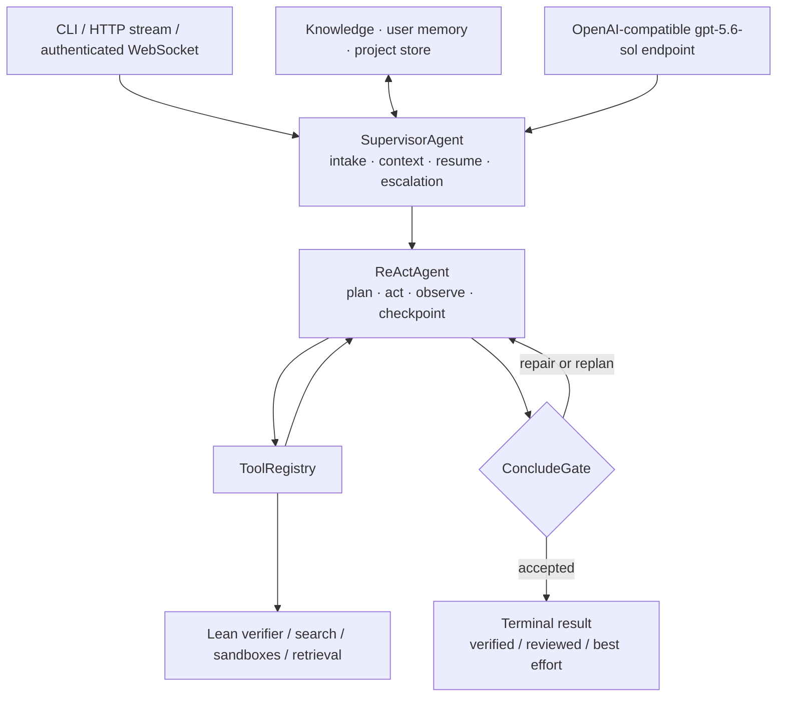

# Conjecta Math Agent

English | [简体中文](README.zh-CN.md)

Project website: <https://conjecta.cn>

Conjecta is a bounded mathematical reasoning agent with one production solve
engine: `SupervisorAgent` prepares the request and `ReActAgent` reasons, calls
tools, and runs reviewers. The CLI and web transports share that contract.

Answers report an honest verification status. LLM review is useful evidence,
but only a successful formal observation may produce `verified`; see
[Verification semantics](#verification-semantics).

Formal observations now carry a stable `Formal evidence ID` that binds the
target claim to the exact Lean artifact. A formal conclusion must cite an ID
created after the most recent rejected conclusion; only that accepted artifact
is returned or admitted to verified memory.

The evidence also records the actual theorem/lemma signature extracted from
the checked artifact. A compiler success without an identifiable declaration
cannot produce `verified`.

## Quick start

Requirements: Python 3.10+, Git, an API key, and an OpenAI-compatible endpoint
that serves `gpt-5.6-sol`. PDF uploads also need Poppler (`pdfinfo` and
`pdftoppm`); on Ubuntu install `poppler-utils`.

```bash
git clone https://github.com/conjecta/conjecta.git
cd Conjecta-v0
# Preferred: locked install via uv (CI and production use the same path)
uv sync --frozen --extra dev
# Alternative without uv:
# python -m venv .venv && source .venv/bin/activate
# python -m pip install -e ".[dev]"
```

Run the web UI or CLI:

```bash
math-agent-web
math-agent "Prove that sqrt(2) is irrational"
```

- Project page: <http://127.0.0.1:8000/>
- Chat app: <http://127.0.0.1:8000/app>
- Local setup: [docs/local-install.md](docs/local-install.md)
- Model endpoint setup: [OpenAI-compatible API](docs/openai-setup.md)
- Security policy and deployment boundary: [SECURITY.md](SECURITY.md)

Copy `config.example.toml` to the ignored `config.toml` for local defaults.
API secrets belong in environment variables and must never be committed. The
Web application accepts only `openai/gpt-5.6-sol`; set the compatible endpoint
through `[llm].base_url` or `CONJECTA_LLM_BASE_URL`.

Compiled frontend assets are committed so the web UI works after a normal
Python install. Node.js is required only when changing the frontend.

## Production solve architecture



For the detailed component map, see
[the architecture notes](docs/agent-architecture.md).

`auto` and `react` both use this ReAct engine. **Formal escalation is a
policy, not a mode**: when the problem requires formal verification and the
proof does not close, the supervisor runs bounded replan rounds
(`escalation_replan_rounds`, default 1) under larger budgets
(`escalation_max_react_steps` / `escalation_max_tool_calls`), with planning
forced on, the reviewer panel always on, and the failed round's Lean
diagnostics injected as context — a Hilbert-style reasoner↔prover feedback
loop. During lemma-decomposition proofs (`prove_by_lemmas`), each lemma first
tries REPL tactic search with the optional prover-role model before spending
an LLM codegen round; independent lemmas in one dependency level are proved
concurrently (`lemma_max_parallel`), failed lemmas get one recursive
sub-decomposition rescue (`lemma_rescue_enabled`), and each attempt can
sample multiple proof routes (`lemma_route_count`). Clarifying follow-ups use
a smaller budget and fewer reviewers, not a second solver. Historical CoT,
staged, geeky, and research modules are not production solve routes. Do not
add a second or legacy solve stack alongside `SupervisorAgent`/`ReActAgent`;
extend their explicit intake, tool, reviewer, or budget seams instead.

See [WORKFLOW.md](WORKFLOW.md) for the detailed execution and trust boundaries.

## Verification semantics

The terminal payload uses these statuses:

| Status | Meaning |
|---|---|
| `verified` | Required formal verification succeeded and the accepted conclusion is supported by the successful formal observation. |
| `reviewed` | The reviewer panel accepted the conclusion; this is not a claim that Lean proved it. |
| `unreviewed` | The conclusion completed but review was skipped (e.g. a fast easy-answer path or no reviewer configured). Not a claim that it was reviewed or proved. |
| `best_effort` | The bounded run returned the best supported answer available without satisfying the stronger acceptance boundary. |
| `blocked` | A required reviewer/formal boundary rejected the conclusion or the run could not safely complete. |

Terminal labels are derived from `VerificationOutcome` in
`math_agent/agent/verification.py`, with four orthogonal dimensions
(completion / review / formal / fidelity). `verified` means formal verification
succeeded and fidelity did not fail; `reviewed` means the reviewer panel
accepted it without formal proof; `unreviewed` means completed with review
skipped. Evidence acceptance uses the `is_review_backed` predicate (formal
verified or review passed).

The UI must preserve those distinctions and must not relabel `reviewed` or
`best_effort` output as a proof.

## Benchmarks

Single-attempt (pass@1) results from the tiered benchmark suite; third-party
benchmark artifacts are intentionally not committed. Build the default suite
with `scripts/build_benchmark_suite.py` and reproduce any row with
`scripts/evaluate_math_agent.py`. Unless noted, runs used the `gpt-5.6-sol`
endpoint and Lean toolchain
`leanprover/lean4:v4.30.0`. Only `verified` rows are Lean-checked; numeric
rows are answer-matched (see [Verification semantics](#verification-semantics)).

| Set | n | Score | Judged by | Median cost |
|---|---|---|---|---|
| fast (tier1 basics) | 54 | 100% correct | numeric | 8s / 3.3k tokens |
| AIME sample (tier2) | 50 | 96.0% correct | numeric | 158s / 18.1k tokens |
| **AIME 2025 (full)** | 30 | **96.7% (29/30); 100% with one retry** | numeric | 252s / 21.6k tokens |
| **HMMT Feb 2025 (full)** | 20 | **100% (20/20)** | numeric | 192s / 24.9k tokens |
| Omni-MATH sample (tier3) | 50 | 94.0%; 98.0% with one retry | numeric | 98s / 13.4k tokens |
| formal baseline (tier4, 20 cases x 3 trials) | 60 | 100% | **Lean verified** | 92s / 21.8k tokens |
| miniF2F sample (tier4) | 30 | 66.7% (20/30) | **Lean verified** | 503s / 35.1k tokens |
| Putnam sample (tier5) | 20 | 10.0% (2/20) | **Lean verified** | 1202s / 107.2k tokens |
| formal-hard (tier6, 7 cases x 3 trials) | 21 | 23.8% pass@1, 3/7 pass@3 | **Lean verified** | 1202s / 97.2k tokens |

How to read the formal rows:

- The miniF2F row is **pass@1 with a general-purpose model** — one agent solve
  per problem at ~35k tokens median. Reference points for comparison are
  specialist prover models reported at pass@32 with 32-8192x sampling:
  Goedel-Prover-V2-32B 88.1%, Kimina-Prover-72B 84.0%,
  DeepSeek-Prover-V2-671B 82.4%. At pass@1 the same specialist provers land
  far below their pass@32 figures. A partial full-valid run (stopped at
  60/244 to redirect compute to ablations) scored 58.3% Lean-verified pass@1,
  with the hardest block (all 15 AIME problems) fully covered.
- The Putnam and formal-hard rows are honest lower bounds: Putnam is the
  hardest public formal benchmark, and most systems score near zero there.
- `best_effort` rows are counted as incorrect even when the informal answer
  reads plausibly; only a successful Lean observation produces `verified`.
- The miniF2F sample row aggregates three 10-problem chunks (50% / 90% / 60%);
  run the full valid/test splits with `scripts/run_minif2f.sh`.
- `aime_2025` and `hmmt_feb_2025` are excluded by default because they are
  CC-BY-NC-SA-4.0. See [benchmark artifacts](data/benchmarks/README.md) and
  [third-party notices](THIRD_PARTY_NOTICES.md) before generating them.

### Harness ablation

How much of the above is the model, and how much is the harness? Same model
(`gpt-5.6-sol`), same problems, one raw completion each — no premise
retrieval, no compile-feedback repair, no tools, no escalation — checked once
with the strict verifier (`scripts/ablation_raw_oneshot.py`):

| Set | Raw one-shot | Full harness | Lift |
|---|---|---|---|
| fast (tier1 basics, n=54) | 100%, 103 tok median | 100%, 3.3k tok median | **0pp (tie)** |
| AIME sample (tier2, n=50) | 88.0%, 666 tok median | 96.0%, 18.1k tok median | **+8.0pp** |
| **HMMT Feb 2025 FULL (n=20)** | **80.0–95.0%, two independent samples** | **100%** | **+5–20pp, variance eliminated** |
| miniF2F sample (tier4, n=30) | 50.0%, 2.2k tok median | 66.7%, 35.1k tok median | **+16.7pp** |
| formal-hard (tier6, n=7) | **0/7** | **3/7 (pass@3)** | **+3 problems from zero** |

The lift grows monotonically with difficulty: on easy problems the raw
frontier model is already saturated and the harness exactly ties it; from
competition level up, the harness value concentrates where the model alone
fails. Raw one-shot costs ~1.3k tokens per problem vs the harness's ~25k
median — the 19x spend is the price of consistency. Details in
`docs/benchmark-results-2026-08.md`.

## Browser authentication and memory trust

Production browser authentication is cookie-only: phone verification sets a
`Secure`, `HttpOnly`, `SameSite=Lax` session cookie. Browser code does not store
the access JWT in `localStorage` and does not construct bearer headers from it.

Agent-extracted memory follows `candidate -> approved|reviewed|verified|rejected`:

- new agent-trace knowledge is `candidate`;
- solve-time retrieval admits `approved`, `reviewed`, and `verified` records
  (see `KnowledgeTrustPolicy` in `math_agent/knowledge/trust.py`);
- `verified` requires matching successful formal evidence and is immutable to
  ordinary evaluator rewrites;
- rejected records remain available for audit but are not injected into solves.

## Supabase migrations

Use a dedicated Supabase project when possible. On a shared database, treat
the SQL files in `docs/supabase_*_schema.sql` as the complete Conjecta-owned
surface and review every statement before applying it. The deployment script
never runs database migrations automatically.

Database migrations are intentionally manual and are not run by the deployment
script. Back up the Supabase project, review the SQL, then apply in this order in
the Supabase SQL Editor:

1. [`docs/supabase_knowledge_schema.sql`](docs/supabase_knowledge_schema.sql)
2. [`docs/supabase_tenant_schema.sql`](docs/supabase_tenant_schema.sql)
3. [`docs/supabase_retention_schema.sql`](docs/supabase_retention_schema.sql)
   (after `supabase_operations_schema.sql` and `supabase_billing_schema.sql`)

The first two migrations are repeatable and contain no table deletion. The
second uses `conjecta_users` and `conjecta_projects`, never unrelated generic
application tables. Application traffic uses the service role behind the API;
anon and authenticated clients receive no direct knowledge-table policy.

The retention migration is the one exception: it is the only migration that
deletes rows. Applying it creates `conjecta_prune_telemetry()` and a daily
pg_cron job — it deletes nothing at apply time. The append-only per-call tables
(`conjecta_llm_usage`, `conjecta_usage_events`) and finished
`conjecta_solve_runs` rows are then pruned past
`conjecta_retention_days()` (30), at most `p_batch_limit` (50k) rows per table
per run. The `conjecta_usage_daily` aggregate is never pruned, and runs still
marked `running` are left for run recovery. On an existing deployment with a
backlog, call the function repeatedly until it returns 0 rather than waiting
for the nightly job to catch up one batch at a time.

## Reliability engineering

The 60-problem miniF2F full-run attempt doubled as a soak test and surfaced
three production issues, all fixed with regression tests:

1. **Gateway malformed bodies**: an OpenAI-compatible gateway intermittently
   answers 200 with a plain-text/SSE body, which the SDK returns as a raw
   `str`. Now classified as `MalformedResponseError` and retried with backoff
   instead of crashing `complete()`.
2. **REPL memory accumulation**: Lean REPL sessions grew RSS monotonically
   with retained proof states until the cgroup OOM-killed them mid-search.
   Fixed with proactive session recycling at pool checkin
   (`repl_recycle_after_commands`) plus a circuit breaker that falls back to
   batch compilation after repeated session deaths.
3. **Deep-search routing reachability**: the deterministic deep-search gate
   only counted one-shot `formalize`/`lean_check` failures, so rounds where
   the actor jumped straight to structured tools never escalated. All four
   Lean tools now count toward the trigger.

## Development and CI

```bash
uv sync --frozen --extra dev
uv run pytest -q

cd math_agent/web/frontend
npm ci
npm run typecheck
npm test -- --run
npm run build
npm audit --audit-level=low
```

Run the reproducible core-agent evaluation harness with a JSONL dataset:

```bash
uv run python scripts/evaluate_math_agent.py \
  --dataset data/eval_smoke.jsonl \
  --trials 3 \
  --output data/eval-results/smoke.jsonl
```

The summary reports accuracy, pass@k, latency/tool usage,
`false_verified_rate`, lemma success, research rounds, counterexample rate,
peak goal parallelism, and wall-time breakdown. A verified-but-incorrect result
makes the command fail.

`research` is not a separate runtime mode; formal escalation is a policy on
the normal ReAct path. The eval script's `--mode` accepts `auto` / `react`, and the
`--research-max-parallel-goals` ablation flag was removed with the knob it set.
See [`docs/research-mode.md`](docs/research-mode.md).

For tool extension choices and the in-process registration API, see
[`docs/tool-registration.md`](docs/tool-registration.md).

Internal workflow diagrams (task routing, the Hermes loop, the pre-solve
planner) are maintained under [`docs/internal/`](docs/internal/) for
contributors; they document the team's operating procedures, not a public
contract.

ReAct checkpoints also persist a proof-goal DAG (root, active sub-goal,
dependencies, attempts, issues, and accepted evidence). For substantial
informal problems, `agent.conclusion_candidate_count = 3` enables bounded
reviewer-ranked Best-of-N; the default remains `1` to avoid increasing every
request's latency and cost.

Human-in-the-loop execution is durable rather than connection-blocking. When
enabled under `[agent.hitl]`, long formal solves can pause after proof-graph
planning, counterexamples and blocked reviews can be escalated, and configured
write tools require approval. The pending action is stored in the checkpoint
before the stream emits `human_input_required`; approve/reject/edit decisions
resume through `/api/solve/{checkpoint_id}/decisions/stream`. A resumed
approval uses the exact stored action and a decision can be claimed only once.

GitHub Actions runs Python tests, the complete frontend gate on Node 20.19, and
a portable Lean source-safety scan. Generated frontend output is built in a
temporary CI directory so tests do not dirty the checkout.

## Production deployment

Optional features, not prerequisites: billing, phone authentication, and the
Supabase multi-tenant migrations are only needed if you want those features.
A single-user local installation works with no database at all.

Read [SECURITY.md](SECURITY.md) first. The built-in execution restrictions are
appropriate for trusted local use; hostile multi-tenant deployments require an
external container or equivalent isolation boundary and reviewed outbound
network policy.

Production must satisfy these boundaries before deployment:

- install Poppler: `apt-get install poppler-utils`, then verify `pdfinfo -v` and
  `pdftoppm -v`;
- start Uvicorn with `--no-proxy-headers --ws-max-size 16777216`;
- configure Nginx with `client_max_body_size 16m`, overwrite `X-Real-IP` with
  `$remote_addr`, overwrite `X-Forwarded-For` with `$remote_addr` (never
  `$proxy_add_x_forwarded_for`), and overwrite `X-Forwarded-Proto` with
  `$scheme` or fixed `https` in the TLS site; set `proxy_read_timeout` to at
  least 7200s (above `deep_search_wall_seconds` / long formal escalation
  budgets) so long solves are not cut at the proxy;
- set `CONJECTA_TRUSTED_PROXY_CIDRS` to the actual Nginx peer CIDRs (normally
  loopback), plus hardened auth/rate/docs environment values;
- keep the application decoded attachment cap below the 16 MiB transport
  envelope.

`--no-proxy-headers` is essential: the application must see Nginx as the socket
peer before it decides whether the overwritten proxy headers are trusted.
Client-supplied `X-Forwarded-For` is never an auth or rate-limit identity.

After the database migration has been applied manually and the target commit is
published, run:

```bash
sudo CONJECTA_REPO_DIR=/opt/conjecta/Conjecta-v0 \
  scripts/deploy_conjecta.sh main
```

The deploy script locates the Conjecta vhost itself: it scans the full
`nginx -T` output for `server` blocks whose `proxy_pass` targets
`127.0.0.1:8010` (or `localhost:8010`) and asserts only those blocks —
`client_max_body_size` must be present and at most 16m (the Uvicorn
`--ws-max-size 16777216` envelope), `proxy_read_timeout` must be at least
7200s (above long formal-escalation / deep-search budgets), and the three
proxy header overwrites must be set. `client_max_body_size` and
`proxy_read_timeout` may
be inherited from the enclosing `http` context. If no matching server block
exists the deployment refuses to proceed. `CONJECTA_NGINX_SITE` remains only
as an override that restricts the scan to a single file; it does not need to
be set in normal operation.

[`scripts/deploy_conjecta.sh`](scripts/deploy_conjecta.sh) takes a lock,
preserves dirty state in a timestamped Git stash, fetches and fast-forwards
`main` to the exact requested ref, builds a locked release virtualenv and
frontend beside the live runtime, validates assets/Nginx, swaps only while the
service is stopped, restarts systemd, and retries `/healthz`. Previous runtime
directories and the stash are retained and reported for deliberate recovery.
Tracked source is normalized to root ownership with service-group read access
before startup. The script never performs a hard reset, Git clean, or automatic
database mutation.

Logs are written to `logs/math-agent.log` and `logs/sessions/`.

## License

Original code and documentation are licensed under the
**GNU Affero General Public License v3.0**; see [LICENSE](LICENSE). If you
modify Conjecta and run it as a network service, the AGPL requires you to
make your modified source code available to the users of that service.

Optional third-party data and bundled frontend dependencies retain their
own terms; see [THIRD_PARTY_NOTICES.md](THIRD_PARTY_NOTICES.md).
