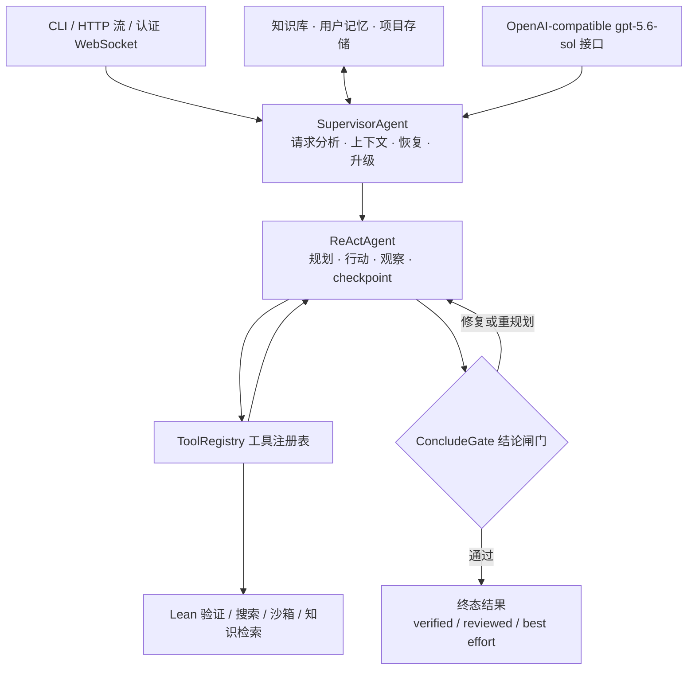

# Conjecta 数学智能体

[English](README.md) | 简体中文

项目官网：<https://conjecta.cn>

Conjecta 是一个带有明确资源边界和验证边界的数学推理智能体。生产环境只有一条求解主链：
`SupervisorAgent` 负责请求分析、上下文组织和按需升级，`ReActAgent` 负责推理、调用工具、执行审阅并生成结论；CLI、HTTP 流式接口和 WebSocket 共用同一套约束。

系统会如实报告验证状态。LLM 审阅可以作为证据，但只有成功完成的形式化验证才能产生
`verified` 状态。每个形式化结果都带有稳定的 `Formal evidence ID`，将目标命题绑定到实际通过检查的 Lean 产物；仅仅编译成功但无法识别定理或引理声明，不会被标记为已验证。

## 主要特性

- 单一生产求解引擎，避免多套历史流程产生不一致行为；
- 公开 Web/API 只接受 `openai/gpt-5.6-sol`，通过 OpenAI-compatible `base_url` 接入；CLI 可配置其他兼容模型；
- Lean 4 / mathlib4 形式化验证，并区分 `verified`、`reviewed` 和 `best_effort`；
- 有界的规划、工具调用、审阅、失败修复和形式化升级预算；
- 支持知识库、用户记忆、项目存储、checkpoint 和证明轨迹；
- 内置 Web UI、CLI、HTTP 流式接口和认证 WebSocket；
- 编译后的前端资源随 Python 包分发，普通安装不需要 Node.js。

## 快速开始

环境要求：Python 3.10+、Git、一个 API Key，以及能够提供 `gpt-5.6-sol` 的
OpenAI-compatible 接口。处理 PDF 还需要 Poppler（Ubuntu 上安装 `poppler-utils`）。

```bash
git clone https://github.com/conjecta/conjecta.git
cd Conjecta-v0

# 推荐：使用与 CI、生产部署一致的锁文件
uv sync --frozen --extra dev

# 不使用 uv 时：
# python -m venv .venv
# source .venv/bin/activate
# python -m pip install -e ".[dev]"
```

配置 API：

```bash
export OPENAI_API_KEY="your-api-key"
export OPENAI_BASE_URL="https://your-provider.example/v1"
export CONJECTA_LLM_MODEL="gpt-5.6-sol"
```

也可以复制示例配置：

```bash
cp config.example.toml config.toml
```

`config.toml` 已被 Git 忽略。密钥必须通过环境变量提供，禁止提交到仓库。公开 Web/API
只接受 `openai/gpt-5.6-sol`，部署环境不能通过环境变量扩大模型白名单。

启动 Web UI 或 CLI：

```bash
math-agent-web
math-agent "证明 sqrt(2) 是无理数"
```

- 项目首页：<http://127.0.0.1:8000/>
- 对话应用：<http://127.0.0.1:8000/app>
- 本地安装：[docs/local-install.md](docs/local-install.md)
- 模型接口配置：[docs/openai-setup.md](docs/openai-setup.md)
- 安全边界：[SECURITY.md](SECURITY.md)

## 生产求解架构



更完整的组件图和实现说明见
[架构详解](docs/agent-architecture.md)。

`auto` 和 `react` 都使用同一个 ReAct 引擎。形式化升级是一条策略，而不是另一种求解模式：
当题目要求形式化证明但当前证明没有闭合时，Supervisor 会在更大的有界预算下进行修复、重试或重规划，并把上一轮 Lean 诊断注入下一轮。若同一轮中多次形式化修复失败，系统可进入更深的搜索路径，但仍受 wall-clock、LLM 调用和工具调用上限约束。

在引理分解证明中，同一依赖层的独立引理可以有界并发验证；失败引理可以进行一次递归分解救援。所有正式结论仍必须经过 `ConcludeGate`，缺少形式化证据时不能返回 `verified`。

完整的执行与信任边界见 [WORKFLOW.md](WORKFLOW.md)。

## 验证状态

| 状态 | 含义 |
|---|---|
| `verified` | 必需的形式化验证成功，且最终结论由已接受的形式化证据支持。 |
| `reviewed` | 审阅面板接受了结论，但这不表示 Lean 已经证明它。 |
| `unreviewed` | 已生成结论，但审阅被明确跳过；不表示已经审阅或证明。 |
| `best_effort` | 在有界预算内返回证据支持程度最高的阶段性答案，但没有达到更强的验收边界。 |
| `blocked` | 必需的审阅或形式化边界拒绝了结论，或者系统无法安全完成。 |

UI 必须保留这些区别，不得把 `reviewed` 或 `best_effort` 展示为已经证明。

## 基准结果

下表为分层测试集上的单次尝试（pass@1）结果。第三方基准原始文件不会提交到仓库；可通过
`scripts/build_benchmark_suite.py` 构建默认测试集，并使用
`scripts/evaluate_math_agent.py` 复现结果。除非另有说明，测试使用 `gpt-5.6-sol`
和 `leanprover/lean4:v4.30.0`。

| 测试集 | 数量 | 结果 | 判定方式 | 中位成本 |
|---|---:|---:|---|---:|
| fast（tier1 基础） | 54 | 100% | 数值匹配 | 8 秒 / 3.3k tokens |
| AIME sample（tier2） | 50 | 96.0% | 数值匹配 | 158 秒 / 18.1k tokens |
| **AIME 2025 全集** | 30 | **96.7%（29/30）；一次重试后 100%** | 数值匹配 | 252 秒 / 21.6k tokens |
| **HMMT 2025-02 全集** | 20 | **100%（20/20）** | 数值匹配 | 192 秒 / 24.9k tokens |
| Omni-MATH sample（tier3） | 50 | 94.0%；一次重试后 98.0% | 数值匹配 | 98 秒 / 13.4k tokens |
| formal baseline（20 题 × 3 次） | 60 | 100% | **Lean 验证** | 92 秒 / 21.8k tokens |
| miniF2F sample（tier4） | 30 | 66.7%（20/30） | **Lean 验证** | 503 秒 / 35.1k tokens |
| Putnam sample（tier5） | 20 | 10.0%（2/20） | **Lean 验证** | 1202 秒 / 107.2k tokens |
| formal-hard（7 题 × 3 次） | 21 | 23.8% pass@1，3/7 pass@3 | **Lean 验证** | 1202 秒 / 97.2k tokens |

如何解读形式化验证行：

- miniF2F 行是**通用模型的 pass@1**——每个问题一次智能体求解，中位约 35k tokens。对比参考点是按 pass@32、每问题 32-8192 次采样报告的专用证明器模型：Goedel-Prover-V2-32B 88.1%、Kimina-Prover-72B 84.0%、DeepSeek-Prover-V2-671B 82.4%；这些专用证明器在 pass@1 下远低于其 pass@32 数字。一次部分全集 valid 运行（在 60/244 处停止以把算力转向消融实验）得到 58.3% Lean 验证 pass@1，其中最难的一批（valid 中全部 15 道 AIME 题）已完全覆盖。
- Putnam 和 formal-hard 行是诚实的下界：Putnam 是最难的公开形式化基准，多数系统在此接近 0。
- `best_effort` 即使文本答案看起来合理，也按错误计算；只有成功的 Lean 观察才能产生 `verified`。
- miniF2F 样本行由三个 10 题片段（50% / 90% / 60%）汇总；完整 valid/test 拆分可用 `scripts/run_minif2f.sh` 运行。
- `aime_2025` 和 `hmmt_feb_2025` 默认不生成，因为它们是 CC-BY-NC-SA-4.0。生成前请阅读[基准数据说明](data/benchmarks/README.md)和[第三方声明](THIRD_PARTY_NOTICES.md)。

### 消融实验：harness 的贡献

上面的成绩有多少来自模型、多少来自 harness？同一模型（`gpt-5.6-sol`）、同一批题目、每次一个裸补全——没有前提检索、没有编译反馈修复、没有工具、没有升级——用严格验证器检查一次（`scripts/ablation_raw_oneshot.py`）：

| 测试集 | 裸模型单次 | 完整 harness | 提升 |
|---|---|---|---|
| fast（tier1 基础，n=54） | 100%，中位 103 tok | 100%，中位 3.3k tok | **0pp（持平）** |
| AIME sample（tier2，n=50） | 88.0%，中位 666 tok | 96.0%，中位 18.1k tok | **+8.0pp** |
| **HMMT 2025-02 全集（n=20）** | **80.0–95.0%，两次独立采样** | **100%** | **+5–20pp，方差消除** |
| miniF2F sample（tier4，n=30） | 50.0%，中位 2.2k tok | 66.7%，中位 35.1k tok | **+16.7pp** |
| formal-hard（tier6，n=7） | **0/7** | **3/7（pass@3）** | **从零到 3 题** |

提升随难度单调增长：简单题上裸模型已饱和，harness 正好持平；从竞赛难度起，harness 的价值集中在模型单靠自身失败的地方。裸模型单次每题约 1.3k tokens，harness 中位约 25k——19 倍的成本是换取一致性的代价。完整数据见
`docs/benchmark-results-2026-08.md`。

## 浏览器认证与记忆信任

生产浏览器认证仅使用 Cookie：手机号验证成功后设置 `Secure`、`HttpOnly`、
`SameSite=Lax` 的会话 Cookie。浏览器不会把访问 JWT 保存到 `localStorage`，也不会自行构造 Bearer Header。

智能体提取的知识遵循：

```text
candidate -> approved | reviewed | verified | rejected
```

- 新提取的知识默认为 `candidate`；
- 求解时只注入 `approved`、`reviewed` 和 `verified`；
- `verified` 必须绑定匹配的成功形式化证据，普通评估器不能覆盖；
- `rejected` 保留用于审计，但不会注入后续求解。

## 数据库迁移

建议为 Conjecta 使用独立 Supabase 项目。数据库迁移不会由部署脚本自动运行；应用迁移前应备份数据库并逐条审阅 `docs/supabase_*_schema.sql`。

核心迁移顺序：

1. [`docs/supabase_knowledge_schema.sql`](docs/supabase_knowledge_schema.sql)
2. [`docs/supabase_tenant_schema.sql`](docs/supabase_tenant_schema.sql)
3. [`docs/supabase_retention_schema.sql`](docs/supabase_retention_schema.sql)

保留策略迁移是唯一会在之后定期删除旧遥测数据的迁移；应用迁移本身不会立即删除数据。完整约束见英文 README 和对应 SQL 文件。

## 可靠性工程

60 题的 miniF2F 全集试运行同时充当了浸泡测试，暴露了三个生产问题，均已修复并附带回归测试：

1. **网关畸形响应**：某个 OpenAI 兼容网关偶尔以纯文本/SSE 形式返回 200，SDK 将其作为原始 `str` 返回。现在归类为 `MalformedResponseError` 并用退避重试，而不是让 `complete()` 崩溃。
2. **REPL 内存累积**：Lean REPL 会话随保留的证明状态单调增长 RSS，直到 cgroup OOM 在搜索中途将其杀死。通过在池回收时主动回收会话（`repl_recycle_after_commands`）加一个在反复会话死亡后回退到批量编译的熔断器修复。
3. **深度搜索路由不可达**：确定性深度搜索闸门只统计一次性 `formalize`/`lean_check` 失败，导致 actor 直接跳到结构化工具的轮次从不升级。现在所有四个 Lean 工具都计入触发条件。

## 开发与 CI

```bash
uv sync --frozen --extra dev
uv run pytest -q

cd math_agent/web/frontend
npm ci
npm run typecheck
npm test -- --run
npm run build
npm audit --audit-level=low
```

运行可复现评估：

```bash
uv run python scripts/evaluate_math_agent.py \
  --dataset data/eval_smoke.jsonl \
  --trials 3 \
  --output data/eval-results/smoke.jsonl
```

GitHub Actions 会运行 Python 3.10/3.11 测试、Ruff、mypy、依赖审计、wheel 检查、完整前端门禁，以及不依赖本地 Lean 安装的源码安全扫描。真正的 Lean 集成测试位于独立 workflow 中。

内部工作流图（任务路由、Hermes 循环、pre-solve planner）维护在 [`docs/internal/`](docs/internal/) 供贡献者使用；它们描述的是团队的作业流程，不是对外契约。

## 生产部署

可选功能，不是前置条件：计费、手机号认证和 Supabase 多租户迁移只在需要这些功能时才用得上。单机本地安装可以完全不用数据库。

部署前先阅读 [SECURITY.md](SECURITY.md)。内置执行限制适用于可信本地环境；面向不可信多租户时，必须增加外部容器或等效隔离，以及经过审阅的出站网络策略。

生产环境至少需要：

- 安装并验证 Poppler；
- Uvicorn 使用 `--no-proxy-headers --ws-max-size 16777216`；
- Nginx 请求体限制不超过 16 MiB，并正确覆盖代理来源 Header；
- 长求解的 `proxy_read_timeout` 至少为 7200 秒；
- `CONJECTA_TRUSTED_PROXY_CIDRS` 只包含真实可信代理；
- 手工审阅并应用数据库迁移，不允许部署脚本自动修改数据库。

部署脚本只执行 fast-forward、锁定依赖构建、资源验证、运行目录切换和健康检查；不会执行 hard reset、Git clean 或自动数据库迁移。详细说明见英文 README 和
[`scripts/deploy_conjecta.sh`](scripts/deploy_conjecta.sh)。

## 许可证

原创代码和文档采用 **GNU Affero General Public License v3.0**，见 [LICENSE](LICENSE)。如果你修改 Conjecta 并作为网络服务运行，AGPL 要求你把修改后的源码提供给该服务的用户。

可选第三方数据和打包的前端依赖继续适用各自的许可证与条款，见
[THIRD_PARTY_NOTICES.md](THIRD_PARTY_NOTICES.md)。
