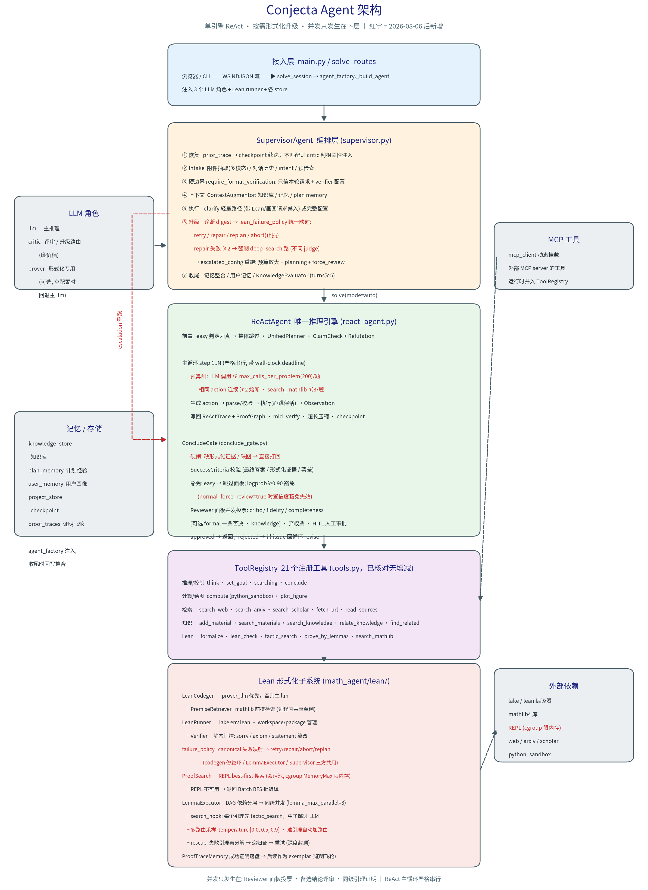

# Conjecta Agent 架构详解

> 基于 2026-08-09 代码快照，单引擎 ReAct + 按需形式化升级；已与当前代码逐项核对

---

## 架构概览



```
                        ┌──────────────────────────┐
   浏览器 / CLI  ──────► │  Web 层 / main.py         │
   WS NDJSON stream     │  solve_routes             │
                        │   → solve_session         │
                        │   → agent_factory._build_agent
                        └────────────┬─────────────┘
                                     │  注入 3 个 LLM 角色 + Lean runner + 各 store
                                     │  llm(主) / critic(廉价) / prover(可选, [llm.prover])
                                     ▼
╔══════════════════════════════════════════════════════════════════════╗
║  SupervisorAgent   (supervisor.py:315, 编排层, mode ∈ {auto, react}) ║
╠══════════════════════════════════════════════════════════════════════╣
║  ① 恢复    prior_trace → ReActTrace.from_checkpoint                  ║
║            (problem 精确匹配才续跑, :449-463)                        ║
║  ② Intake  supervisor_intake.analyze                                 ║
║       ├─ 附件由多模态 LLM 抽成文本 (非 OCR, :473-485)                ║
║       ├─ 最近 10 轮对话 (≤8000 字符) 注入 intake                     ║
║       ├─ intent: new_problem | extend | clarify                      ║
║       │     (带 Lean/画图请求的 follow-up 强制 extend)               ║
║       ├─ source 抓取 / needs_search 预检索 (clarify 不付搜索费用)    ║
║       └─ require_formal_verification ← resolve_formal_verification   ║
║            (硬信任边界: 调用方显式传参优先, 否则按本轮请求 +         ║
║             verifier 配置重算, 覆盖 intake LLM 判断)                 ║
║  ③ 上下文  三分支 (:566-610)                                         ║
║            续跑 → checkpoint preamble; clarify → 只用对话上下文      ║
║            其余 → ContextAugmentor.augment → context_preamble        ║
║            prior_trace 未匹配 → _maybe_inject_prior_trace            ║
║            (critic 判相关性后注入)                                   ║
║  ④ 执行    _run_react                                                ║
║       ├─ clarify 轻量路径 → build_subagent_config(私有 config)       ║
║       │     max_steps=4, reviewers=(), 无 HITL, 无记忆整合           ║
║       └─ 正常路径 → 完整 AgentConfig                                 ║
║  ⑤ 升级    require_formal 且未 verified → escalation_replan_rounds 轮║
║       ├─ _lean_failure_digest(trace, :71) 提炼 failure_kinds + draft ║
║       ├─ 上轮 formalize/lean_check 失败 ≥2 → 强制 deep_search        ║
║       │     (确定性, 不问 judge; _DEEP_SEARCH_MIN_REPAIR_FAILURES=2) ║
║       ├─ _judge_escalation_route(critic) → retry | repair | replan   ║
║       │     判不出 → lean_failure_policy 映射兜底 (canonical 事实源) ║
║       │     policies 含 abort 且无 repair → 止损 break               ║
║       └─ escalated_config 重跑 (每轮全新 trace; deep_search 轮再覆盖 ║
║           wall_seconds=3600 / tactic_search_max_attempts=200,        ║
║           hint 引导 tactic_search / prove_by_lemmas)                 ║
║  ⑥ 收尾    _run_post_solve (:772-832, 可 defer 到连接关闭后)         ║
║       ├─ MemoryConsolidator → knowledge_store + plan_memory          ║
║       ├─ UserMemoryConsolidator (带对话历史) → user_memory_store     ║
║       └─ _maybe_evaluate (需 project_id 非空且 turns≥5)              ║
╚═══════════════════════════════════┬══════════════════════════════════╝
                                    ▼
╔══════════════════════════════════════════════════════════════════════╗
║  ReActAgent  (react_agent.py:125, 唯一推理引擎)                      ║
╠══════════════════════════════════════════════════════════════════════╣
║  前置 (easy 判定 _is_easy_prompt :1229-1243, easy 则整体跳过)        ║
║    _maybe_plan       → UnifiedPlanner (:993-1048, 唯一路径,          ║
║                        一次调用同产 informal plan + Lean sketch)     ║
║    _maybe_claim_check→ ClaimCheck (+ Refutation 反例计算, :1049-1126)║
║                                                                      ║
║  LLM 预算  LLMCallCounter + CallCountingBackend (tracking.py:25-60)  ║
║            actor/critic/lean_codegen 共用一个计数器 (:140-162);      ║
║            超 max_calls_per_problem(默认 200) 即 break,              ║
║            降级 best_effort 并写 verification issues (:556-567)      ║
║                                                                      ║
║  主循环 step 1..max_react_steps, 带 max_wall_seconds deadline        ║
║    ┌────────────────────────────────────────────────────┐            ║
║    │ LLM 预算检查 → 上下文压缩                           │           ║
║    │ _generate_action / _generate_action_native (工具调用)│          ║
║    │   → _parse_action_safe → _validate_action (:628,    │           ║
║    │     先 parse 后 validate)                           │           ║
║    │ 相同 action 熔断: 连续 ≥2 次记 identical_action_limit│          ║
║    │   并 break (:648-670); conclude → ConcludeGate      │           ║
║    │ HITL tool_approval 暂停 (:698-718)                  │           ║
║    │ 工具预算检查 (:719-745, 耗尽后 fall-through 到      │           ║
║    │   final-answer synthesis); unknown_action /         │           ║
║    │   invalid_action_args 不消耗预算 (:88-97)           │           ║
║    │ search_mathlib 独立上限 3 次/solve (:764-780)       │           ║
║    │ _execute_action (_execute_with_heartbeat 保活心跳)  │           ║
║    │ Observation 写回 ReActTrace + ProofGraph            │           ║
║    │ _maybe_mid_verify (独立预算 3 次, 每 2 轮一次)      │           ║
║    │ on_checkpoint → project_store.write_checkpoint      │           ║
║    └────────────────────────────────────────────────────┘            ║
║                                                                      ║
║  action == conclude  →  ConcludeGate.handle (conclude_gate.py:77)    ║
║    ├─ 硬闸: 要求形式化但无绑定 evidence → missing_formal_evidence    ║
║    │   打回 (:178-206); 需图但没嵌图 → missing_diagram (:207-242)    ║
║    ├─ GoalRun/SuccessCriteria 校验 (require_final_answer /           ║
║    │   require_formal_verification / min_report_count / vote_margin) ║
║    ├─ _should_skip_review: force_review=True 不跳; easy 豁免要求     ║
║    │   非形式化; normal_force_review=True 且非 easy 时禁用           ║
║    │   logprob≥0.90 豁免 (:1458-1460, 生产配置下基本不生效)          ║
║    ├─ _evaluate_conclusion_candidates (candidate_count>1 且          ║
║    │   turns≥4 且非形式化才启用; 默认 1=关闭)                        ║
║    ├─ Reviewer 面板并发投票 (:1736, reviewers_enabled 默认三个)      ║
║    │    critic / fidelity / completeness   [可选 formal, knowledge]  ║
║    │    formal 的 FAIL 一票否决; LLM reviewer 走加权投票;            ║
║    │    reviewer 异常 → fallback 主模型重试一次, 仍失败记            ║
║    │    UNAVAILABLE 弃权票, 不计入 quorum (:1744-1777)               ║
║    ├─ HITL: human_interaction.pause_for_human ⇄ 前端 approve         ║
║    └─ approved → break ; rejected → 带 issue 回循环 revise           ║
╚═══════════════════════════════════┬══════════════════════════════════╝
                                    ▼
╔══════════════════════════════════════════════════════════════════════╗
║  ToolRegistry  (tools.py, 21 个注册工具, 清单已与代码核对一致)       ║
╠══════════════════════════════════════════════════════════════════════╣
║  推理/控制   think, set_goal, searching, conclude                     ║
║  计算/绘图   compute (python_sandbox), plot_figure (plot_sandbox)     ║
║  检索        search_web, search_arxiv, search_scholar, fetch_url,     ║
║              read_sources                                            ║
║  知识        add_material, search_materials, search_knowledge,        ║
║              relate_knowledge, find_related                          ║
║  Lean        formalize, lean_check, tactic_search, prove_by_lemmas,   ║
║              search_mathlib                                          ║
║  (外部)      MCP 工具经 mcp_client 动态挂载                           ║
╚═══════════════════════════════════┬══════════════════════════════════╝
                                    ▼
╔══════════════════════════════════════════════════════════════════════╗
║  Lean 形式化子系统 (math_agent/lean/)                                ║
╠══════════════════════════════════════════════════════════════════════╣
║  failure_policy ─ lean_failure_policy(failure_kind) 统一映射         ║
║      retry/repair/abort/replan (:42-56); codegen 修复环 /            ║
║      LemmaExecutor / Supervisor 升级路由三方的单一事实源             ║
║  LeanCodegen ── prover_llm 优先, 否则主 llm                          ║
║      └─ PremiseRetriever (mathlib 检索, 进程内共享单例)              ║
║  LeanRunner  ── lake env lean, workspace/package 管理                ║
║      └─ Verifier (静态门控: sorry/axiom/statement 篡改)              ║
║  repl_session ─ cgroup v2 限内存 (systemd-run MemoryMax, :51-82)     ║
║      repl_memory_limit_mb=4096; 无 systemd-run 时降级不限制并告警    ║
║  ProofSearch ── REPL 模式 best-first (heapq, proof_search.py:307-318)║
║                 ↘ 不可用时退回 Batch BFS                             ║
║  LemmaExecutor ─ DAG 依赖分层 → 同级并发 (lemma_max_parallel)        ║
║      ├─ search_hook: 每个引理先试 tactic_search, 中了就跳过 LLM      ║
║      ├─ 多路由采样 temperature [0.0, 0.5, 0.9][:route_count];        ║
║      │    _estimate_route_count 按难度分级, 难引理升到               ║
║      │    lemma_max_routes_hard=5 (difficulty_threshold=4)           ║
║      └─ _rescue_lemma: 失败引理再分解 → 递归证 → 带 sub 重试,        ║
║           深度硬顶 lemma_rescue_max_depth=2                          ║
║  ProofTraceMemory ─ 成功证明落盘, 后续作为 exemplar (证明飞轮)       ║
╚══════════════════════════════════════════════════════════════════════╝
```

**图注（ToolRegistry 细节，已与当前代码核对）**:
- 21 个工具与上表完全一致，无增删改名
- `think` / `set_goal` / `conclude` / `update_plan` 是 `_SPECIAL_ACTIONS`（tools.py:117），不受 `enabled_tools` 过滤
- 内部名 `search` 对外披露为 `search_web`（tools.py:460）
- Lean 四个工具有条件注册，缺依赖时注册为 unavailable 占位（tools.py:438-453）
- MCP 工具经 `_register_mcp_tools`（tools.py:467-493）并入同一 `_tools` 表
- 附注：`proof_search.py:207` 的类 docstring 仍写 "Breadth-first"，已过时；实际 REPL 路径是 best-first（heapq, proof_search.py:307-318）

---

## 三个结构性事实

**只有一个引擎。** cot / staged / research 都已删除，`mode` 只剩 `auto` 和 `react`，两者走同一条 `_run_react`。研究模式不再由用户选择，改为形式化失败后 Supervisor 自动 escalation。

**子 agent 是"降配的同一个引擎"，不是并发 worker。** [subagent.py](../math_agent/agent/subagent.py) 的 `build_subagent` 只做一件事：从 `SharedSubagentDeps` + `SubagentSpec` 造一个带**私有 config** 的 `ReActAgent`。`SubagentSpec` 新增 `force_review`（subagent.py:50-52）和 `planning`（:53-55）两个字段；`build_subagent_config` 额外强制 `planning_enabled=False`、`normal_claim_check_enabled=False`、`normal_force_review=False`（:93-100），保证子 agent 不会自己再升级。当前两个调用点都在 supervisor 内 —— clarify 轻量路径和 escalation 轮。没有多 agent 并行编排。

**并发只发生在下层三处：** reviewer 面板并发投票、备选结论并发评审、LemmaExecutor 同级引理并发。ReActAgent 主循环本身严格串行。

---

## 核心流程

### 1. 普通数学题（无形式化要求）

```
用户: "解方程 x^2 - 5x + 6 = 0"
  ↓
supervisor.solve(mode="auto")
  ├─ Intake: intent="new_problem", require_formal_verification=False
  ├─ Augmentor: 无相关记忆
  └─ react_agent (max_steps=12)
      ├─ step 1: compute(code="...")
      ├─ step 2: conclude(answer="x=2 或 x=3")
      └─ ConcludeGate
          ├─ _should_skip_review: easy 且 skip_review_on_easy_prompt → 跳过面板
          └─ approved → return
```

**关键点**:
- 不走 planning（easy 判定为真时前置阶段全部跳过）
- 面板默认三个 LLM reviewer：critic / fidelity / completeness（无 formal）
- easy 且 `skip_review_on_easy_prompt` 时整个面板被豁免；conclude 的 logprob 置信度 ≥ `skip_review_min_confidence`(0.90) 也可豁免，但 `normal_force_review=True`（生产默认）且非 easy 时该置信度豁免被禁用

---

### 2. 形式化证明请求（首次成功）

```
用户: "用 Lean 4 证明：对任意自然数 n，n + 0 = n"
  ↓
supervisor.solve()
  ├─ Intake: require_formal_verification=True (显式请求)
  └─ react_agent (round 1, max_steps=12)
      ├─ step 1: formalize
      │   └─ LeanCodegen
      │       ├─ PremiseRetriever.retrieve("n + 0")
      │       │   └─ [Nat.add_zero, Nat.zero_add, ...]
      │       └─ LLM 生成: theorem add_zero_eq ...
      ├─ step 2: lean_check
      │   └─ LeanRunner.check_proof()
      │       ├─ Verifier.check_static() (门控通过)
      │       └─ lake env lean --run ✓
      └─ step 3: conclude
          └─ ConcludeGate
              ├─ SuccessCriteria.require_formal_verification
              │   └─ 已有通过的 lean_check 形式化证据 ✓
              └─ approved → return

verification_status = "verified"
```

**关键点**:
- `require_formal_verification=True` 由 `resolve_formal_verification`（supervisor_intake.py:93-106）决定，
  不采纳 intake LLM 的判断（防 prompt 里夹带"不用验证"）；调用方显式传参优先（supervisor.py:492-493），
  否则按 `formal_policy ∈ {explicit, all_theorems, disabled}`（config.py:247-250，非法值回落 `explicit`，
  遗留别名 `require_lean_for_theorems ≡ all_theorems`）重算并覆盖 intake 结论：
  `explicit` 用 `_LEAN_REQUEST_RE` 只匹配**当前轮**文本，`all_theorems` 用 `_THEOREM_REQUEST_RE` 匹配完整 problem
- 没有形式化证据时 ConcludeGate 硬闸 `missing_formal_evidence` 不放行；`force_review` 下连置信度豁免也失效
- 不触发 escalation（首轮就 verified 了）

---

### 3. 形式化证明失败 → 自动升级

```
用户: "用 Lean 证明：素数有无穷多个"
  ↓
supervisor.solve()
  ├─ Intake: require_formal_verification=True
  └─ react_agent (round 1, max_steps=12)
      ├─ step 1: formalize → 生成证明骨架
      ├─ step 2: lean_check ✗ (type error)
      ├─ step 3: 修复 → lean_check ✗ (tactics failed)
      ├─ ...
      ├─ step 12: conclude(answer="证明思路: ...")
      └─ verification_status = "best_effort"  ← 没闭合

  ↓ supervisor 检测到失败 (supervisor.py:649)

  escalation! (escalation_replan_rounds=1)
      ├─ 提取诊断: _lean_failure_digest(trace, :71)
      │   └─ text + failure_kinds + 上一轮 draft
      │       "[lean_check] unknown constant Nat.Prime.infinite"
      ├─ 确定性深搜判定: 上一轮 trace 中 formalize/lean_check 失败
      │   ≥ _DEEP_SEARCH_MIN_REPAIR_FAILURES(=2, :68) → 强制 route="deep_search",
      │   不问 judge (:672-682)
      ├─ 否则路由: _judge_escalation_route(critic_llm, digest, :155-181)
      │   ├─ retry  : 纯基建问题 (超时/编译环境)，原样再来一次
      │   ├─ repair : 局部错误 (unknown constant / type error)，改而不重规划
      │   └─ replan : 证明路线本身不对，重新分解
      │   (judge 只许返回这三者；deep_search 由调用方确定性强制，
      │    模型永远选不了, :179-181)
      │   └─ judge 失败/无输出 → lean_failure_policy(failure_kind) 兜底
      │       (lean/failure_policy.py:42-56, canonical 映射)
      ├─ 止损: policies 含 abort 且不含 repair → 直接 break (:692-699)
      ├─ 注入上下文: context_preamble += digest.text + route hint
      │   (deep_search 的 hint 引导改用 tactic_search / prove_by_lemmas, :144-151)
      └─ react_agent (round 2, escalated_config, 每轮全新 trace :734-743)
          ├─ max_react_steps = 24  (原 12)
          ├─ planning_enabled = True (强制开启)
          ├─ force_review = True
          ├─ deep_search 轮再覆盖 (:704-715):
          │   max_wall_seconds = deep_search_wall_seconds (3600)
          │   tactic_search_max_attempts = deep_search_max_attempts (200)
          │   tactic_search_wall_seconds 同步放大
          │
          ├─ Planning (前置)
          │   └─ UnifiedPlanner → 分解为引理
          │
          ├─ step 1: prove_by_lemmas
          │   └─ LemmaExecutor.execute()
          │       ├─ Planner: 分解为 [L1, L2, L3, main]
          │       ├─ _lemma_levels: [[L1], [L2, L3], [main]]
          │       └─ 逐层验证
          │           ├─ Level 0: L1 ✓
          │           ├─ Level 1: L2 ✓, L3 ✗
          │           │   └─ rescue → L3_sub1 ✓, L3_sub2 ✓
          │           │   └─ retry L3 ✓
          │           └─ Level 2: main ✓
          │
          └─ step 2: conclude
              └─ verification_status = "verified" ✓

最终返回: 已验证的形式化证明
```

**关键机制**:

1. **escalation 触发条件** ([supervisor.py:649](../math_agent/agent/supervisor.py#L649)):
   ```python
   if (
       intake.require_formal_verification
       and not light_path
       and self.lean_runner is not None
   ):
       rounds_left = max(0, int(self.config.escalation_replan_rounds))
       while rounds_left > 0 and solution.verification_status != "verified":
           digest = _lean_failure_digest(trace)
           if not digest:
               break        # 没有 Lean 失败可诊断 → 升级预算也是浪费
           ...
   ```

2. **诊断提取** (`_lean_failure_digest`, [supervisor.py:71](../math_agent/agent/supervisor.py#L71)):
   - 只保留 Lean 工具的失败输出 (`formalize`, `lean_check`, `tactic_search`, `prove_by_lemmas`)
   - 返回三部分：`text`(prompt-ready 摘要)、`failure_kinds`(驱动路由)、`draft`(上一轮代码)
   - 注入格式: "Previous proof attempt failed. Lean diagnostics: ..."

3. **路由与兜底** (4 个取值: `retry | repair | replan | deep_search`):
   - **确定性 deep_search**（[supervisor.py:672-682](../math_agent/agent/supervisor.py#L672)）:
     上一轮 trace 中 `formalize`/`lean_check` 失败次数 ≥ `_DEEP_SEARCH_MIN_REPAIR_FAILURES`(=2, :68)
     时强制 `route="deep_search"`，完全不问 judge
   - `_judge_escalation_route`（:155-181）只许返回 retry/repair/replan，注释明确
     deep_search 由调用方确定性强制、模型永远选不了（:179-181）
   - judge 失败兜底不再是 "_INFRA/_REPAIR 规则"，而是调用 canonical 映射
     `lean_failure_policy(failure_kind)`（[failure_policy.py:42-56](../math_agent/lean/failure_policy.py#L42)）:
     `retry={timeout, lean_unavailable}`；
     `repair={bad_import, syntax, unknown_constant, type_mismatch, missing_instance, lean_error, unsolved_goals}`；
     `abort={termination}`；其余 → `replan`
   - **abort 止损**: policies 含 `abort` 且不含 `repair` 时直接 break，不再烧升级预算（:692-699）

4. **escalated_config** (从当前 `react_config or self.config` 派生):
   ```python
   replace(
       react_config or self.config,
       max_react_steps=self.config.escalation_max_react_steps,   # 24
       max_tool_calls=self.config.escalation_max_tool_calls,     # 16
       planning_enabled=True,   # 强制开
       force_review=True,       # 取消 easy/高信心 的 review 豁免
   )
   ```
   每轮还额外强制 `require_formal_verification=True` 和 `planning=True` 传给 `_run_react`。
   deep_search 轮在 escalated_config 之上再覆盖（:704-715）:
   `max_wall_seconds=deep_search_wall_seconds`(3600)、
   `tactic_search_max_attempts=deep_search_max_attempts`(200)、`tactic_search_wall_seconds`。
   每轮 escalation 都是**全新 trace**（不传 initial_trace, :734-743），repair 失败计数看上一轮。

---

## Lean 子系统详解

### 工具分工

| 工具 | 用途 | 实现 | 适用场景 |
|------|------|------|----------|
| **formalize** | 非形式 → Lean | LeanCodegen | 单个命题的直接翻译 |
| **lean_check** | 验证单个证明 | LeanRunner | 已有完整代码，只需验证 |
| **tactic_search** | 战术序列搜索 | ProofSearch | 简单命题，需要找证明 |
| **prove_by_lemmas** | 引理分解证明 | LemmaExecutor | 复杂定理，需分步证明 |

### failure_policy: 统一失败语义

新增模块 [failure_policy.py](../math_agent/lean/failure_policy.py)（56 行）：`lean_failure_policy(failure_kind)`（:42-56）
把 Lean 失败类型统一映射为 `retry / repair / abort / replan` 四种处置，是 codegen 修复环、LemmaExecutor、
Supervisor 升级路由三方的**单一事实源**——三方不再各自维护失败分类规则，Supervisor 的 judge 兜底也直接调用它
（映射表见上文"路由与兜底"）。

### tactic_search: 战术搜索

**流程**:
```
ProofSearch.search(theorem_statement, imports)
  │
  ├─ REPL 可用? (repl_enabled=True && binary exists)
  │   │
  │   ├─ Yes → _search_repl (REPL 模式)
  │   │   ├─ LeanReplSession.run_command("lemma ... sorry")
  │   │   │   └─ 返回 proof_state id + structured goal
  │   │   │
  │   │   ├─ Best-first search (heap priority queue)
  │   │   │   ├─ 优先级 = (goal_count, goal_size, depth, push_order)
  │   │   │   └─ 总是先扩展"最有希望"的状态
  │   │   │
  │   │   ├─ TacticGenerator.generate(state)
  │   │   │   ├─ ProofTraceMemory.similar(statement)  ← 相似证明作为 exemplar
  │   │   │   ├─ PremiseRetriever.retrieve(goal)      ← 相关定理
  │   │   │   ├─ LLM 生成候选战术
  │   │   │   └─ Critic 重排序 (prover_llm 评分)
  │   │   │
  │   │   ├─ LeanReplSession.run_tactic(tactic, state_id)
  │   │   │   ├─ success → 新 proof_state + goals
  │   │   │   └─ completed? (no goals left)
  │   │   │       └─ 批验证确认 (REPL 不是最终权威)
  │   │   │
  │   │   └─ 成功 → ProofTraceMemory.record()
  │   │
  │   └─ No → _search_batch (批编译模式)
  │       └─ BFS, 每步 lake env lean --run
  │
  └─ 返回 ProofSearchResult(success, proof, attempts)
```

**REPL 优势**:
- **快**: 无需每步重编译，状态在内存中
- **准**: 结构化 goal，不依赖 regex 解析
- **广**: best-first 预算可以更大 (代码默认 max_attempts=64 vs 批模式的 32)
- **内存可控**: REPL 进程经 `systemd-run --scope --property=MemoryMax={limit}M --property=MemorySwapMax=0`
  包进 cgroup v2 限驻留内存（repl_session.py:51-82 `_memory_limited_argv`；弃用 RLIMIT_AS，
  因 Lean 虚拟地址空间巨大）。无 `systemd-run` 时降级为不限制并告警

**配置** (代码默认值 / config.toml 覆盖):
```toml
[lean]
repl_enabled = true               # 代码默认 False, 生产开
tactic_search_max_attempts = 32   # 代码默认 64
tactic_search_max_depth = 8       # 代码默认 12
repl_memory_limit_mb = 4096       # cgroup MemoryMax
```

**ProofTraceMemory (证明飞轮)**:
- 每个成功的证明自动记录到 `.lean_workspace/.conjecta_cache/proof_traces.jsonl`
- 后续搜索时，相似 statement 的证明作为 few-shot exemplar
- 无需训练循环，纯推理时数据积累

---

### prove_by_lemmas: 引理分解证明

**适用场景**: 复杂定理，单次 LLM 生成无法闭合

**流程**:
```
LemmaDAGExecutor.execute()
  │
  ├─ 1. Planner: 非形式证明 → 引理分解
  │   └─ 返回 FormalizationPlan
  │       ├─ lemmas: [{"name": "helper1", "statement": "...", "depends_on": []}, ...]
  │       ├─ goal_type: "..."
  │       └─ recommended_imports: [...]
  │
  ├─ 2. _lemma_levels: DAG 依赖分析
  │   └─ 拓扑排序 → [[L1], [L2, L3], [L4]]
  │       (同级引理无依赖关系，可并行)
  │
  ├─ 3. 逐层执行
  │   ├─ Level 0: [L1]
  │   │   └─ _prove_lemma(L1)
  │   │       ├─ search_hook 优先 (REPL tactic_search, 12 attempts, depth=6)
  │   │       │   └─ 成功 → 跳过 LLM codegen
  │   │       ├─ _sample_bodies(route_count=3)  ← 多路由采样
  │   │       │   ├─ temperature = [0.0, 0.5, 0.9] (多样化)
  │   │       │   │   (难引理 _estimate_route_count 升到 lemma_max_routes_hard=5)
  │   │       │   └─ 并发生成 (asyncio.gather)
  │   │       ├─ 批验证 (串行，首个通过即停)
  │   │       └─ 失败 → 修复循环 (max_repair_attempts=3)
  │   │
  │   ├─ Level 1: [L2, L3] (并发 gather, max_parallel=3)
  │   │   ├─ _prove_lemma(L2) ✓
  │   │   └─ _prove_lemma(L3) ✗
  │   │       └─ rescue_enabled? → _rescue_lemma(L3)
  │   │           ├─ _decompose_lemma: 分解为 [L3_sub1, L3_sub2]
  │   │           ├─ 递归 _prove_lemma(L3_sub1) ✓
  │   │           ├─ 递归 _prove_lemma(L3_sub2) ✓
  │   │           └─ 重试 _prove_lemma(L3, with subs in context) ✓
  │   │
  │   └─ Level 2: [L4]
  │       └─ _prove_lemma(L4) ✓
  │
  └─ 4. 主定理
      └─ _prove_lemma(main_theorem, with all lemmas in context) ✓
```

**关键机制**:

1. **search_hook** (tools.py:1713):
   - REPL pool 可用时，每个引理先尝试 tactic_search (12 attempts, depth=6)
   - 成功 → 直接用搜索结果，跳过 LLM codegen round
   - 失败 → fall back to LLM

2. **多路由采样** (lemma_executor.py:235):
   ```python
   async def _sample_bodies(system, prompt, count):
       temperatures = [0.0, 0.5, 0.9][:count]
       bodies = await asyncio.gather(
           *[_generate(system, prompt, temp) for temp in temperatures]
       )
       return [clean(body) for body in bodies if body]
   ```
   - route_count=3 → 生成 temp=0.0 / 0.5 / 0.9 三个版本
   - 并发验证，首个通过即接受
   - `_estimate_route_count`（lemma_executor.py:263）按难度分级：难度 ≥ `lemma_difficulty_threshold`(4)
     的引理升到 `lemma_max_routes_hard`(5) 条路由

3. **递归救援** (lemma_executor.py:260):
   ```python
   async def _rescue_lemma(idx, lemma, system, total):
       sub_lemmas = await _decompose_lemma(name, statement)
       for sub in sub_lemmas:
           code = await _prove_lemma(sub, ...)
           if code is None: return None
           self.verified_lemmas.append(code)
       return await _prove_lemma(idx, lemma, ...)  # 重试，带子引理
   ```
   - 失败引理 → LLM 分解为最多 4 个子引理
   - 递归验证子引理
   - 子引理加入 context 后重试父引理
   - rescue 深度硬顶 `lemma_rescue_max_depth=2`（:120-127, :401），避免无限递归

4. **并行控制** (lemma_executor.py:558):
   ```python
   semaphore = asyncio.Semaphore(max_parallel)
   async def prove_one(idx, lemma):
       async with semaphore:
           return await _prove_lemma(idx, lemma, context_code, verified_snapshot, total)

   results = await asyncio.gather(*(prove_one(idx, lemma) for idx, lemma in level))
   ```
   - 同级引理并发验证 (bounded by max_parallel；代码默认 6，config.toml 覆盖为 3)
   - Lean 编译本身还受 `max_concurrent_checks` 限制（代码默认 4，config.toml 覆盖为 2）

**配置** (代码默认值 / config.toml 覆盖):
```toml
[lean]
lemma_max_parallel = 3                # 同级并行度 (代码默认 6)
lemma_rescue_enabled = true           # 递归救援 (深度硬顶 lemma_rescue_max_depth=2)
lemma_route_count = 3                 # 多路由采样 (难引理升到 lemma_max_routes_hard=5,
                                      #   lemma_difficulty_threshold=4)
lemma_executor_wall_seconds = 1800.0  # 整体超时 (代码默认 240)
lemma_hook_max_attempts = 12          # search_hook 预算 (depth=6)
lemma_route_temperatures = [0.0, 0.5, 0.9]
```

---

## 模型路由

### 三个 LLM 角色

| 角色 | 用途 | 配置 | 默认模型 |
|------|------|------|----------|
| **llm** | 主推理 | `[llm]` | gpt-5.6-sol |
| **critic_llm** | 验证/评分 | `[llm.critic]` | gpt-5.6-sol |
| **prover_llm** | 形式化证明 | `[llm.prover]` | (空，fall back to llm) |

### prover_llm 路由

**生效范围**:
- `TacticGenerator` (tactic_search 的候选生成)
- `LemmaExecutor` (prove_by_lemmas 的引理证明)

**配置示例** (config.toml):
```toml
[llm.prover]
provider = "openai"
model = "gpt-5.6-sol"
base_url = "http://localhost:8000/v1"  # 自部署端点
temperature = 0.7
```

**路由逻辑** (tactic_search 在 tools.py:1557-1563, prove_by_lemmas 在 :1829):
```python
generator = TacticGenerator(
    ctx.prover_llm or ctx.llm,  # prover 优先，否则 fall back
    ...
)
```

**作用**:
- 主推理模型专注规划 + 工具调用
- 形式化任务分流给专门模型 (DeepSeek-Prover / Kimina-Prover)
- 空配置时完全透明 (用主模型)

---

## 关键配置清单

### agent (预算控制；未标注者均为 dataclass 代码默认值)
```toml
[agent]
max_react_steps = 12                    # 普通求解轮次上限
max_tool_calls = 8                      # 工具调用数上限 (0=无限)
max_wall_seconds = 600                  # 整体 deadline
max_conclusion_revisions = 3            # conclude 被打回的最大修订次数
max_identical_action_repeats = 2        # 相同 action 连续熔断阈值 (记 identical_action_limit)
conclusion_candidate_count = 1          # 备选结论并发评审 (1=关闭; >1 需 turns≥4 且非形式化)
search_mathlib_max_calls = 3            # search_mathlib 独立 per-solve 上限
escalation_max_react_steps = 24         # 形式化升级预算
escalation_max_tool_calls = 16
escalation_replan_rounds = 1            # 重跑次数 (每轮全新 trace)
deep_search_wall_seconds = 3600         # deep_search 轮整体超时 (config.toml:32-36 显式配置)
deep_search_max_attempts = 200          # deep_search 轮 tactic_search 预算
deep_search_parallel_routes = 2         # deep_search 轮并行策略路线数
                                        #   (tactic_search 优先 vs prove_by_lemmas 优先,
                                        #   首个 verified 胜出; 1=串行旧行为)
planning_enabled = true                 # 代码默认开 (升级轮强制开; 仅 UnifiedPlanner 一条路)
normal_claim_check_enabled = false      # 假设审计; 生产 config.toml 覆盖为 true
normal_force_review = false             # 非 easy 时禁用 logprob 置信度豁免; 生产覆盖为 true
mid_verify_enabled = false              # 中途验证; 生产覆盖为 true
mid_verify_max_calls = 3                # 独立预算, 不占 max_tool_calls (max_corrections=2
                                        #   后转持久 issue)
mid_verify_every = 2                    # 每 2 轮一次
react_context_max_chars = 16000         # 上下文渲染字符上限 (兜底)
react_context_max_tokens = 0            # token 预算主动压缩触发值; 0=推导为 chars/4
planning_max_chars = 2500

# LLM 调用预算在 [llm] 下: max_calls_per_problem = 200 (LLMConfig, config.py:36-38)
# actor/critic/lean_codegen 共用同一计数器, 耗尽即 break 并降级 best_effort

# 成本门控：不是单一预算，而是分层豁免
easy_prompt_classifier = "critic"       # critic | rules；easy 则跳过
                                        # planning / claim_check / mid_verify / 面板
skip_review_on_easy_prompt = true
skip_review_min_confidence = 0.90       # conclude 的 exp(mean logprob) 达标即跳过面板;
                                        # normal_force_review=true 且非 easy 时该豁免禁用
reviewers_enabled = ["critic", "fidelity", "completeness"]
                                        # 另可加 "formal"(Lean 一票否决) / "knowledge"
                                        # 注意: config.example.toml:71 只列了两个
                                        # (critic/fidelity), 与 dataclass 默认三个不一致
review_vote_margin = 0.0                # 加权 FAIL 需超过 PASS + margin 才打回

# HITL (HitlConfig, config.py:74-106)
# enabled = false                       # 默认关; 生产 config.toml 覆盖为 true
# mode = "adaptive"
# auto_resolve_seconds = 600
```

### lean (形式化配置；区分代码默认值 / config.toml 覆盖)
```toml
[lean]
repl_enabled = true                     # REPL 加速 (代码默认 False, 生产开; 需 lake build repl)
repl_max_sessions = 2                   # 会话池大小 (代码默认 4)
repl_step_timeout_seconds = 60.0        # 单步超时
repl_init_timeout_seconds = 300.0       # 首次 import 超时
repl_memory_limit_mb = 4096             # REPL 进程 cgroup MemoryMax (MB)

tactic_search_max_attempts = 32         # 代码默认 64
tactic_search_max_depth = 8             # 代码默认 12

lemma_max_parallel = 3                  # 引理并行度 (代码默认 6)
lemma_rescue_enabled = true             # 递归救援
lemma_rescue_max_depth = 2              # rescue 深度硬顶
lemma_route_count = 3                   # 多路由采样
lemma_difficulty_threshold = 4          # 难度 ≥ 4 的难引理...
lemma_max_routes_hard = 5               # ...路由数升到 5
lemma_executor_wall_seconds = 1800.0    # 整体超时 (代码默认 240)
lemma_hook_max_attempts = 12            # search_hook 预算 (depth=6)
lemma_route_temperatures = [0.0, 0.5, 0.9]

max_concurrent_checks = 2               # 进程级编译并发 (代码默认 4)
premise_index_enabled = true            # mathlib 前提检索 (代码默认 True)
```

### verifier (形式化策略)
```toml
[verifier]
formal_policy = "explicit"              # explicit | all_theorems | disabled
# explicit: 只在显式请求时要求 Lean ("用 Lean 证明"), _LEAN_REQUEST_RE 只匹配当前轮文本
# all_theorems: 所有定理类问题都要求 Lean, _THEOREM_REQUEST_RE 匹配完整 problem
# disabled: 完全禁用形式化
# 非法值回落 explicit; 遗留别名 require_lean_for_theorems ≡ all_theorems (config.py:247-250)
```

### llm (per-problem 调用预算)
```toml
[llm]
max_calls_per_problem = 200             # LLMConfig (config.py:36-38); actor/critic/lean_codegen
                                        # 共用计数器, 耗尽即 break 并降级 best_effort,
                                        # 消耗量记入 ReActSolution.llm_call_count
```

### llm.prover (可选专用模型)
```toml
[llm.prover]
model = ""                              # 空=禁用，fall back to llm
provider = "openai"
base_url = "http://localhost:8000/v1"
temperature = 0.7
```

---

## 性能特性

### 时间开销 (典型值)

| 场景 | 预算 | 实际耗时 | 瓶颈 |
|------|------|----------|------|
| 简单计算 | 1-3 steps | 5-15s | LLM 推理 |
| 中等推理 | 5-8 steps | 30-60s | 多轮工具调用 |
| 形式化 (首次成功) | 2-5 steps | 20-40s | Lean 编译 |
| 形式化 (escalation) | 12+24 steps | 120-300s | 引理分解 + 多轮验证 |
| prove_by_lemmas (5 引理) | 1 step | 60-180s | 并行验证 + rescue |

### 并发控制

**LLM 层** (并发只发生在下层，没有 agent 级并行):
- ReActAgent 主循环: 串行 (一步一步来)
- Reviewer 面板: `asyncio.gather` 并发投票 ([react_agent.py:1736](../math_agent/agent/react_agent.py#L1736))
- 备选结论评审: 主答案与 `_generate_alternative_conclusions` 的候选并发过面板
- LemmaExecutor: 同级引理并发 (bounded by `lemma_max_parallel`，代码默认 6 / 生产 3)
- 多路由采样: 并发生成 (asyncio.gather)

**Lean 层**:
- 进程级: `max_concurrent_checks=2` (避免 OOM)
- 引理并发: 受上述 semaphore 限制
- REPL 会话: `repl_max_sessions=2` (长运行会话池)
- REPL 内存: cgroup v2 `MemoryMax=repl_memory_limit_mb`(4096) 硬限，防 REPL 吃光驻留内存

**降级路径**:
- REPL 不可用 → batch compile；无 `systemd-run` → REPL 内存不限制并告警
- prover_llm 未配置 → fall back to llm
- reviewer 抛异常且主/评模型不同 → fallback 主模型重试一次；仍失败记 UNAVAILABLE 弃权票，不计入 quorum
- lean_unavailable → 结论 blocked（goals.py:177-184）
- failure_policy 判 `abort`（如 termination）且无 repair → escalation 止损 break
- 连续修复失败 ≥ 2 次 → 确定性 deep_search（3600s / 200 attempts 大预算最后一搏）
- per-problem LLM 调用预算耗尽 → break 并降级 `best_effort`，写入 verification issues
- search_hook 失败 → LLM codegen
- rescue 失败 → 整个 prove_by_lemmas 失败 (深度硬顶 2，不会无限递归)

---

## 对比: 改动前后

### 之前 (research 模式独立)
```
用户选择 mode="research"
  → SupervisorAgent
     ├─ 强制 require_formal_verification=True
     ├─ 强制 planning=True
     ├─ 大预算 (max_steps=24)
     └─ replan 循环
```
- ❌ 用户需要判断是否"需要研究模式"
- ❌ 前端需要 UI 按钮
- ❌ mode 分支维护成本

### 现在 (按需升级)
```
用户永远传 mode="auto"
  → SupervisorAgent
     ├─ Intake 自动判断 require_formal_verification
     └─ 首轮失败? → 自动 escalation
         ├─ 提取诊断
         ├─ 路由 retry | repair | replan (judge 失败走 canonical failure_policy)
         ├─ 连续修复失败 ≥2 → 确定性 deep_search (3600s / 200 attempts)
         ├─ 扩大预算
         └─ 重跑 (每轮全新 trace)
```
- ✅ 用户无需选择
- ✅ 前端零改动
- ✅ 单一代码路径
- ✅ 易题快 + 难题自动升级

---

## 总结

Conjecta 的 agent 架构是一个**单引擎、多策略、按需升级**的系统：

1. **单引擎**: 只有 ReActAgent，没有独立的 research/cot/staged 引擎
2. **智能路由**: Supervisor 根据 intent/难度/形式化要求自动选择预算档位
3. **按需升级**: 形式化失败时自动扩大预算 + 重跑，对用户透明；路由四选一
   (retry/repair/replan/deep_search)，其中 deep_search 由确定性规则强制
   (上轮修复失败 ≥2 次)，judge 模型永远选不了
4. **统一失败语义**: `lean_failure_policy` 是 codegen 修复环 / LemmaExecutor /
   Supervisor 升级路由三方的 canonical 映射；判 `abort` 且无 repair 时直接止损
5. **per-problem LLM 预算**: actor/critic/lean_codegen 共用一个计数器，
   超 `max_calls_per_problem`(默认 200) 即 break 并降级 best_effort
6. **工具分层**: 普通工具 (compute/search) + Lean 工具 (formalize/prove_by_lemmas) 分工明确
7. **REPL 加速**: tactic_search 和 search_hook 都走 REPL (可用时)，搜索效率大幅提升；
   REPL 进程由 cgroup v2 MemoryMax 硬限内存
8. **引理并行**: DAG 依赖分析 + 同级并发 + 难度分级多路由 + 递归救援 (深度硬顶 2)，复杂定理也能闭合
9. **证明飞轮**: 成功证明自动记录，后续作为 exemplar，无需训练循环
10. **分层门控**: easy 判定 + logprob 置信度两道豁免控制成本；`force_review` /
    `normal_force_review` 可取消豁免（生产 `normal_force_review=true`，
    非 easy 时 0.90 置信度豁免基本不生效）
11. **一条硬信任边界**: `require_formal_verification` 只由调用方显式传参或
    本轮原始请求 + verifier 配置推出，不受 intake LLM 或上下文影响

**核心理念**: 把决策权交给系统，而非用户。用户只需说"解这道题"或"用 Lean 证明"，系统自动决定预算、工具、策略。
